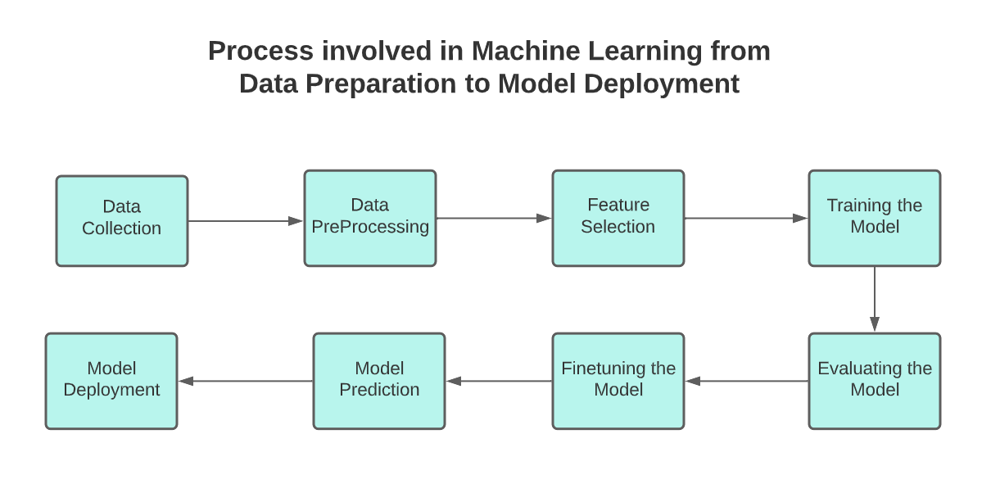

# Data_Mining_Project3_SNAPP

# [ICC Mens World Cup 2023](https://www.kaggle.com/datasets/pardeep19singh/icc-mens-world-cup-2023/data)

# Introduction

Welcome to our ICC Cricket World Cup 2023 predictions! We're excited to use data science to guess who will hit the most 4s and 6s, and which bowler will bowl the most dot balls. In Task 2, we're predicting the teams that will make it to the final and who the top 11 players will be. Task 3 is all about guessing the overall winner of the tournament. Get ready for some cool insights and exciting predictions! 🏏✨

# TEAM 21 SNAPP

### - Priyanka Lalwani - 202218058
### - Sakshi Parihar - 202218042
### - Anisha Anilkumar - 202218038
### - Prachi Shah - 202218027
### - Nandini Parekh - 202001455

# Project Pipeline

# Table of Contents

## [ 1. Dataset description ](#1-dataset-description)
## [ 2. Prediction](#2-prediction)
## [ 3. Conclusion ](#3-conclusion)

