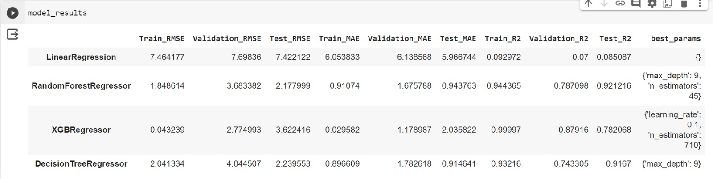

# Data_Mining_Project3_SNAPP

# [ICC Mens World Cup 2023](https://www.kaggle.com/datasets/pardeep19singh/icc-mens-world-cup-2023/data)

# Introduction

Welcome to our ICC Cricket World Cup 2023 predictions! We're excited to use data science to guess who will hit the most 4s and 6s, and which bowler will bowl the most dot balls. In Task 2, we're predicting the teams that will make it to the final and who the top 11 players will be. Task 3 is all about guessing the overall winner of the tournament. Get ready for some cool insights and exciting predictions! 🏏✨

# TEAM 21 SNAPP

### - Priyanka Lalwani - 202218058
### - Sakshi Parihar - 202218042
### - Anisha Anilkumar - 202218038
### - Prachi Shah - 202218027
### - Nandini Parekh - 202001455

# Project Pipeline

# Table of Contents

## [ 1. Dataset description ](#1-dataset-description)
## [ 2. Prediction](#2-prediction)
## [ 3. Conclusion ](#3-conclusion)

## 1. Dataset description

The 2023 ICC Men's Cricket World Cup marks the 13th edition of this quadrennial One Day International (ODI) cricket tournament. Organized by the International Cricket Council (ICC), the event gathers men's national teams in a thrilling competition. India is the proud host of the tournament, which kicked off on October 5 and is set to conclude on November 19, 2023.

In this exciting cricket spectacle, teams will battle it out for supremacy, aiming to etch their names in cricket history. England enters the tournament as the defending champions, having clinched victory in the 2019 edition by defeating New Zealand in a memorable final at Lord's, London.

Content :-

deliveries.csv: Comprehensive ball-by-ball data for all matches.

matches.csv: Detailed information on each match played.

points_table.csv: Current tournament standings.

## 1. Prediction

#### (1) Final Team Prediction - Final_Team_prediction.ipynb

#### (2) Playing 11 - Playing_11.ipynb

#### (3) Percentage Of Dot Balls - percentage_of_dot_balls.ipynb

Overview :-

This section presents the results of predicting the percentage of dot balls for bowlers using various regression models. The analysis involved calculating the percentage of dot balls for each bowler in the dataset, followed by feature selection to identify relevant input features. The selected features were then used to train different regression models to predict the dot ball percentage.

Conclusion :-

The results demonstrate the performance of different regression models in predicting the dot ball percentage for bowlers. The Random Forest Regressor outperformed other models with a high R² score and lower RMSE values on both the validation and test sets.
