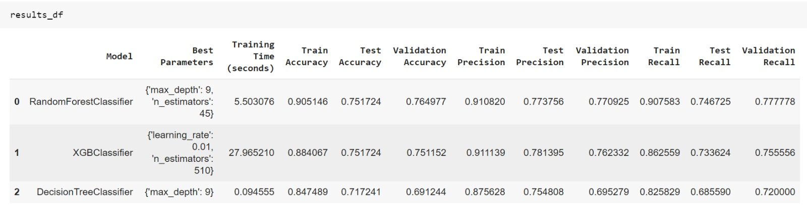
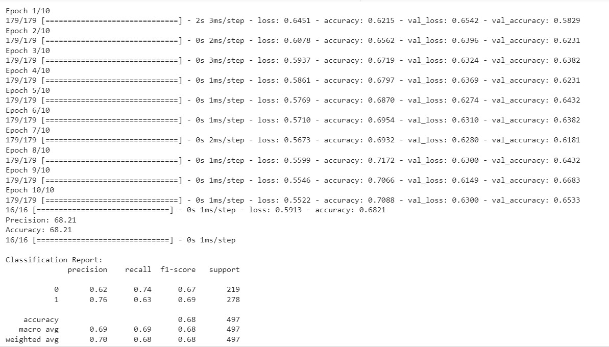

# Data_Mining_Project3_SNAPP

# [ICC Mens World Cup 2023](https://www.kaggle.com/datasets/pardeep19singh/icc-mens-world-cup-2023/data)

# Introduction

Welcome to our ICC Cricket World Cup 2023 predictions! We're excited to use data science to guess who will hit the most 4s and 6s, and which bowler will bowl the most dot balls. In Task 2, we're predicting the teams that will make it to the final and who the top 11 players will be. Task 3 is all about guessing the overall winner of the tournament. Get ready for some cool insights and exciting predictions! 🏏✨

# TEAM 21 SNAPP

### - Priyanka Lalwani - 202218058
### - Sakshi Parihar - 202218042
### - Anisha Anilkumar - 202218038
### - Prachi Shah - 202218027
### - Nandini Parekh - 202001455

# Project Pipeline

# Table of Contents

## [ 1. Dataset description ](#1-dataset-description)
## [ 2. Prediction](#2-prediction)
## [ 3. Conclusion ](#3-conclusion)

## 1. Dataset description

The 2023 ICC Men's Cricket World Cup marks the 13th edition of this quadrennial One Day International (ODI) cricket tournament. Organized by the International Cricket Council (ICC), the event gathers men's national teams in a thrilling competition. India is the proud host of the tournament, which kicked off on October 5 and is set to conclude on November 19, 2023.

In this exciting cricket spectacle, teams will battle it out for supremacy, aiming to etch their names in cricket history. England enters the tournament as the defending champions, having clinched victory in the 2019 edition by defeating New Zealand in a memorable final at Lord's, London.

Content :-

deliveries.csv: Comprehensive ball-by-ball data for all matches.

matches.csv: Detailed information on each match played.

points_table.csv: Current tournament standings.

## 1. Prediction

#### (1) Final Team Prediction - Final_Team_prediction.ipynb

In our final team prediction task, we aimed to forecast the teams that would reach the semi-finals and ultimately predict the winner of the ICC Cricket World Cup 2023. To enhance the accuracy of our predictions, we leveraged a comprehensive dataset that included ODI matches spanning from 2002 to 2023, with a particular emphasis on the ICC World Cup Kaggle data for 2023 (comprising 32 matches).

Data Integration and Importance :

-We merged these datasets to capitalize on the wealth of information from both historical ODI matches and the recent ICC World Cup matches. Special emphasis was given to ICC matches to ensure the relevance and significance of the predictions.

Prediction Models :

-Several machine learning models, including RandomForestClassifier, XGBClassifier, DecisionTreeClassifier, and Artificial Neural Networks (ANN), were employed to predict the outcomes. These models were trained on the integrated dataset, considering team performances, player statistics, and match details.

Semi-Final Teams Prediction :

- Based on our predictions and considering the points table scraped from reliable sources, we identified the top four teams: India, South Africa, Australia, and New Zealand.

Semi-Final Results :

- Our model forecasted semi-final results, with India emerging victorious against New Zealand and South Africa securing a win against Australia.

Final Teams :

- The culmination of our predictions led us to the final face-off between India and South Africa.

World Cup Winner :

- In accordance with our model predictions, India emerged as the predicted winner of the ICC Cricket World Cup 2023.
- This comprehensive approach, blending historical context with recent match data, and utilizing advanced prediction models, provides a robust foundation for our final team prediction task.

#### (2) Playing 11 - Playing_11.ipynb

Our playing XI prediction for India and South Africa involved a meticulous process to ensure the selection of the most impactful players. Here's a step-by-step overview:

Batsmen Selection:

- Batsmen Strike Rate Calculation:

- We calculated the strike rate for each batsman based on runs scored in the first 32 matches from the Kaggle dataset.

Average Batting Strike Rate:

- Computed the average batting strike rate for each batsman, factoring in their performance across matches.

Ranking Batsmen:

- Ranked batsmen based on their average batting strike rates to identify the most consistent and effective performers.

Bowlers Selection:

Bowling Strike Rate Calculation:

- Calculated the bowling strike rate for each bowler using the runs conceded and wickets taken in the first 32 matches.

Average Bowling Strike Rate:

- Determined the average bowling strike rate for each bowler, considering their performance in different matches.

Ranking Bowlers:

- Ranked bowlers based on their average bowling strike rates, highlighting their efficiency and wicket-taking ability.

Model Prediction:

- Trained a predictive model on the squad, incorporating both batsmen and bowlers, to forecast their individual ranks.
  
Rank Prediction:

- Utilized the trained model to predict the ranks of players in the squad, taking into account their overall performances.

Playing XI Selection:

Top Batsmen and Bowlers:

- Displayed the top 6 batsmen and bowlers for India and South Africa based on their predicted ranks.

- This comprehensive approach ensures a balanced and impactful playing XI for each team, combining statistical performance with predictive modeling for an optimal team composition.

#### (3) Percentage Of Dot Balls - percentage_of_dot_balls.ipynb

Overview :-

This section presents the results of predicting the percentage of dot balls for bowlers using various regression models. The analysis involved calculating the percentage of dot balls for each bowler in the dataset, followed by feature selection to identify relevant input features. The selected features were then used to train different regression models to predict the dot ball percentage.

Conclusion :-

- The results demonstrate the performance of different regression models in predicting the dot ball percentage for bowlers. The Random Forest Regressor outperformed other models with a high R² score and lower RMSE values on both the validation and test sets.
